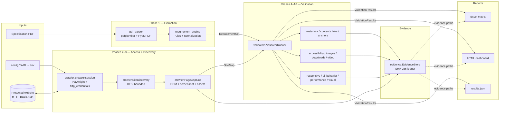
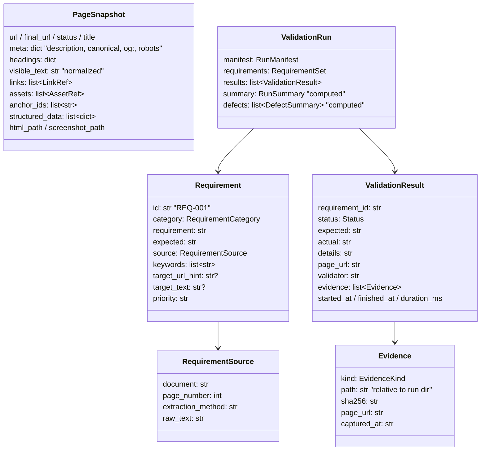
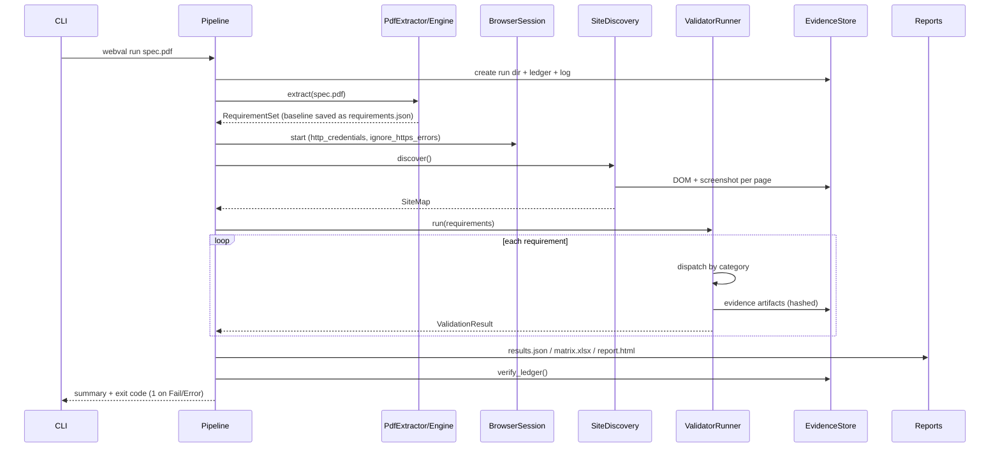

# webval — Design Document

## 1. Purpose and scope

webval verifies a protected website against a source specification PDF and produces complete,
auditable requirement traceability (Requirement → Verification → Evidence → Status) suitable for
pharmaceutical QA/UAT review. It is **not** a scraper: every claim in the output reports is backed
by a hashed evidence artifact, and every extracted requirement appears in the traceability matrix
with an explicit status (including *Not Tested*).

## 2. Architecture overview



### Package layout

```
src/webval/
├── config/              # pydantic-settings; env > YAML > defaults; secret redaction
├── models/              # pydantic domain models (the contracts between packages)
├── pdf_parser/          # PDF -> PdfDocument (text, tables, images, links, metadata, OCR opt-in)
├── requirement_engine/  # PdfDocument -> RequirementSet (5 extraction passes + classification)
├── crawler/             # BrowserSession (auth), SiteDiscovery (BFS), PageCapture (snapshots)
├── validators/          # base + 12 validators + registry (category -> validator dispatch)
├── evidence/            # EvidenceStore: run folders, hashing, append-only ledger
├── reports/             # excel.py, html.py (+ Jinja2 template), json_out.py
├── pipeline.py          # orchestrates a full run
└── cli.py               # typer CLI: run / extract / crawl / report
```

Dependency direction is strictly downward: `models` and `utils` have no internal dependencies;
validators depend on crawler/evidence/models; `pipeline` is the only module that knows the whole
sequence. New validators register in `validators/registry.py` without touching the runner.

## 3. Data models (contracts)



`Status` vocabulary: **Pass / Fail / Warning / Not Tested / Error**. *Warning* means the check
executed and found a near-match or budget breach requiring human judgement (e.g. fuzzy content match
≥ threshold, performance over budget). *Error* means the validator itself failed (still traceable,
never silently swallowed).

## 4. Requirement extraction (Phase 1)

Two engines parse the PDF (layout text + tables via pdfplumber; images, link annotations,
metadata, OCR fallback via PyMuPDF). The requirement engine then runs five ordered passes:

| Pass | Trigger | extraction_method |
|---|---|---|
| 1 | Table with an ID/Requirement/Expected header row (synonym matching) | `table` |
| 2 | Free-text line carrying a requirement ID (`REQ-\d+` etc., configurable) | `explicit_id` |
| 3 | Sentence with a modal construct (shall/must/should/will/…) | `modal_sentence` |
| 4 | Hyperlink annotation or plain-text URL in the spec | `link_annotation` |
| 5 | Embedded image ≥ 80px (candidate design screenshot) | `image_caption` |

Safeguards: pass 2 skips IDs already claimed by pass 1 (pdfplumber's text stream repeats table
cells); duplicate normalized statements are dropped; spec-authored IDs are canonicalized
(`req 12` → `REQ-012`) and auto-allocated IDs never collide with them. Category classification is
an ordered keyword-rule table (`rules.CATEGORY_RULES`) — extensible without engine changes.
Quoted strings become `target_text` (the exact copy/label under test); URLs become
`target_url_hint`.

## 5. Authentication & discovery (Phases 2–3)

- HTTP Basic credentials are injected via Playwright **context `http_credentials`** — they apply
  to every page and subresource, never appear in URLs or evidence.
- `ignore_https_errors` tolerates internal/preprod certificates.
- Contexts are cached per device profile (session reuse); one browser process serves all phases.
- Discovery is a bounded BFS (`max_pages`, `max_depth`, allowed hosts, exclusion patterns) with
  `browser.concurrency` parallel pages and per-page retry (3 attempts, exponential backoff).
- Every page becomes a `PageSnapshot` with DOM evidence + full-page screenshot. DOM parsing is a
  pure function (`crawler.snapshot.parse_html`) so it is unit-testable without a browser.

## 6. Validation (Phases 4–16)

The `ValidatorRunner` dispatches each requirement to the first validator claiming its category.
Unclaimed categories → **Not Tested** with an explanatory actual-result. A validator crash →
**Error** with the exception recorded. Both keep the matrix complete.

| Validator | Categories | Verification approach (summary) |
|---|---|---|
| metadata | Metadata | Field detection (title/description/canonical/robots/OG/H1/JSON-LD) from snapshot; exact/fuzzy compare vs `target_text`, else presence check |
| content | Content, General | Normalized exact match → fuzzy sliding-window (`difflib`) → Fail; duplicate-section detection; match-context snippet evidence |
| links | Link, Navigation | Locate by text/href across site; GET through authenticated request context; status, redirect chain, wrong-destination check |
| anchors | Anchor | Live click; scroll delta + destination-visibility via `getBoundingClientRect`; before/after screenshots |
| accessibility | Accessibility | In-page audit (img alt, button/link accessible names, svg labelling, ARIA); targeted mode when spec pins alt/label text |
| images | Image | `naturalWidth`/`complete` per img; targeted element screenshot or page-wide broken-image audit |
| downloads | Download | Click with download interception → fallback authenticated GET; size > 0; artifact stored + hashed |
| video | Video | Native `<video>`: muted `play()`, `currentTime` advance, media errors. Embeds: player iframe load + rendered size |
| responsive | Responsive | Per device profile: horizontal overflow, heading visibility, hamburger present/opens at mobile widths; screenshot each |
| ui_behavior | UI Behavior | Requirement-keyword dispatch: back-to-top, cookie banner (OneTrust-aware), modal open/close, accordion `aria-expanded` toggle |
| performance | Performance | Injected PerformanceObserver (LCP/CLS/INP-best-effort) + Navigation Timing (TTFB, load); compared to configured budgets → Warning on breach |
| visual | Visual | dHash perceptual compare of spec images vs page screenshots; SPEC/LIVE/DIFF composite evidence; configurable thresholds |

## 7. Evidence & audit trail (Phase 15)

- Run folder layout is fixed (see README). All evidence paths in reports are **relative** so the
  run directory can be zipped and reviewed offline.
- Every artifact is SHA-256 hashed at write time and appended to
  `evidence/logs/evidence_ledger.jsonl` (append-only). The ledger is re-verified at the end of the
  run and can be re-verified at any time (tamper evidence).
- `RunManifest` records: run id, spec filename + SHA-256, tool version, execution window (UTC),
  operator, and the redacted effective configuration → reproducibility.
- The execution log (`evidence/logs/execution.log`) is written in UTC with level + module.

## 8. Execution flow



## 9. Error handling & resilience

- Navigation retried 3× with exponential backoff (`utils.retry_async`); a page that still fails is
  recorded in the site map with its error rather than aborting the run.
- Each validator call is wrapped: exceptions → `Status.ERROR` result with the message; the run
  always completes and reports.
- Downloads and screenshots have graceful fallbacks (request-context fetch; viewport screenshot).
- Secrets: `SecretStr` for the password, redaction in manifests, no credentials in URLs/logs.

## 10. Extensibility

- **New validator**: subclass `BaseValidator`, set `categories`, implement `validate`, add to
  `registry._DEFAULT_CLASSES`.
- **New requirement rule**: append to `rules.CATEGORY_RULES` or `TABLE_HEADER_SYNONYMS`.
- **New device**: add to `devices:` in YAML (any Playwright device descriptor name).
- **New report format**: consume `ValidationRun` (everything is serializable pydantic).
- **AI-assisted comparison (optional)**: the visual validator is the seam — replace/augment
  `dhash` scoring with an ML similarity or vision-model call; evidence contract is unchanged.

## 11. Known limits (documented for auditors)

- Requirement extraction is heuristic; the extracted baseline should be human-reviewed
  (`webval extract`) for formal UAT. Approval of `requirements.json` is a process control.
- INP requires real user interactions; the reported value is best-effort from a synthetic click
  and labelled as such in evidence.
- Cross-origin embedded players expose no playback state; embeds are verified by load + size.
- Single-page apps that render entirely client-side after `networkidle` are supported, but
  infinite-scroll content beyond the initial render is not auto-discovered.
